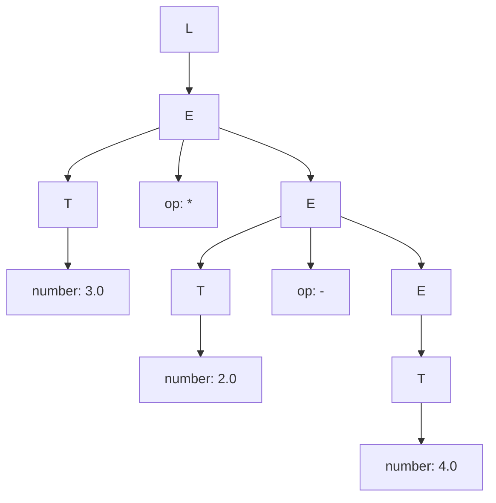
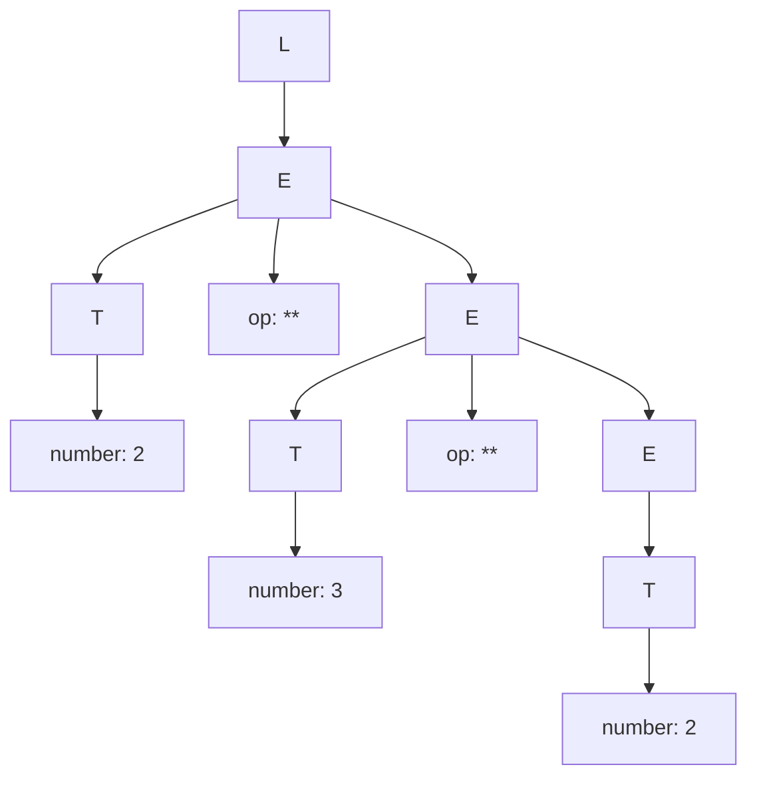
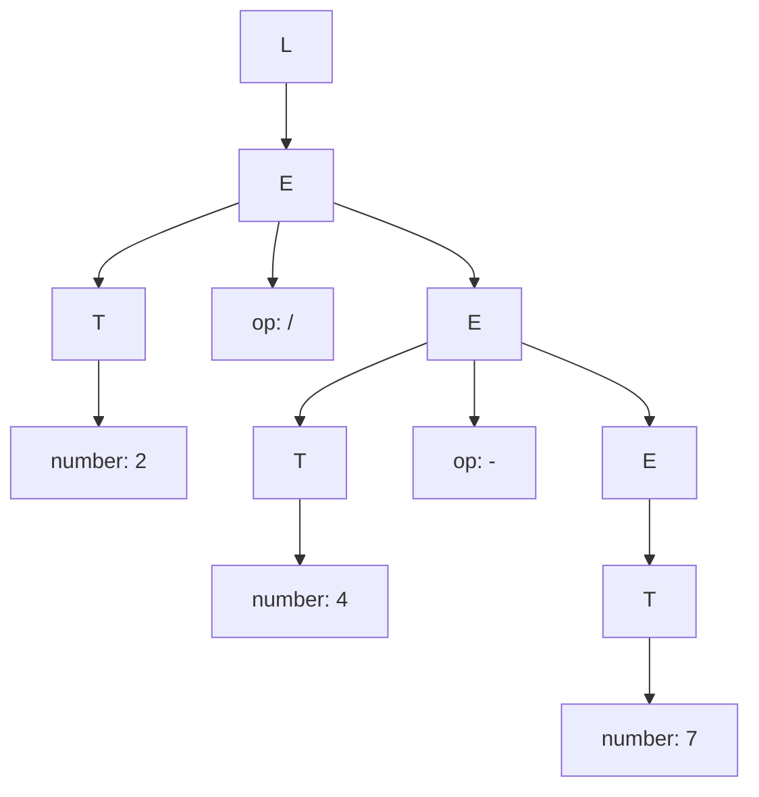

# Syntax Directed Translation with Jison

Jison is a tool that receives as input a Syntax Directed Translation and produces as output a JavaScript parser  that executes
the semantic actions in a bottom up ortraversing of the parse tree.
 

## Compile the grammar to a parser

See file [grammar.jison](./src/grammar.jison) for the grammar specification. To compile it to a parser, run the following command in the terminal:
``` 
➜  jison git:(main) ✗ npx jison grammar.jison -o parser.js
```

## Use the parser

After compiling the grammar to a parser, you can use it in your JavaScript code. For example, you can run the following code in a Node.js environment:

```
➜  jison git:(main) ✗ node                                
Welcome to Node.js v25.6.0.
Type ".help" for more information.
> p = require("./parser.js")
{
  parser: { yy: {} },
  Parser: [Function: Parser],
  parse: [Function (anonymous)],
  main: [Function: commonjsMain]
}
> p.parse("2*3")
6
```

## Resultados

### 1. Describa la diferencia entre /* skip whitespace */ y devolver un token
La diferencia principal se trata a la hora de retorno, con /* skip whitespace */ el encontrar una regla no incluye una sentencia return, el analizador simplemente consume los caracteres que coinciden con la expresión regular y no envía nada al parser. Por otro lado cuando se retorna un token, el analizador detiene su proceso de escaneo y entrega un objeto al parser que contiene el tipo de token y su valor léxico.

### 2. Escriba la secuencia exacta de tokens producidos para la entrada 123**45+@. 
Para la entrada 123**45+@, el analizador léxico procesará la cadena carácter por carácter buscando coincidencias con las reglas definidas en el bloque %lex .
- NUMBER: Corresponde a 123 (coincide con [0-9]+).
- OP: Corresponde a ** (coincide con la regla específica para potencias).
- NUMBER: Corresponde a 45 (coincide con [0-9]+).
- OP: Corresponde a + (coincide con la clase de caracteres [-+*/]).
- INVALID: Corresponde al carácter @. Al no coincidir con ninguna de las reglas anteriores, cae en la regla del punto . que retorna este token.
- EOF: Corresponde al final de la cadena de entrada.

### 3. Indique por qué ** debe aparecer antes que [-+*/].
Esto es debido a que si se quiere  tratar "\*\*" como un token unico se debe poner entre comillas. En el caso de usar [-+*/] antes el analizador tratara el "\*\*" como dos * individuales.

### 4. Explique cuándo se devuelve EOF.
Se devuelve el EOF cuando el analizador encuentra el final del archivo.

### 5. Explique por qué existe la regla . que devuelve INVALID.
La regla "." con retorno (INVALID) sirve para capturar errores de cualquier carácter que no coincida con las reglas anteriores. Su función es evitar que el analizador se bloquee ante símbolos inesperados, permitiendo que el programa informe al usuario de que ha introducido un carácter no válido.


# Practica 5

## 1.1 Derivaciones

### 1.
$L \Rightarrow E$ 
$\Rightarrow E \text{ op } T$ 
$\Rightarrow E \text{ op } T \text{ op } T$ 
$\Rightarrow T \text{ op } T \text{ op } T$ 
$\Rightarrow 4.0 \text{ op } T \text{ op } T$ 
$\Rightarrow 4.0 - 2.0 \text{ op } T$ 
$\Rightarrow 4.0 - 2.0 * 3.0$

### 2.
$L \Rightarrow E$ 
$\Rightarrow E \text{ op } T$ 
$\Rightarrow E \text{ op } T \text{ op } T$ 
$\Rightarrow T \text{ op } T \text{ op } T$ 
$\Rightarrow 2 \text{ op } T \text{ op } T$ 
$\Rightarrow 2 ** 3 \text{ op } T$ 
$\Rightarrow 2 ** 3 ** 2$ 

### 3.
$L \Rightarrow E$ 
$\Rightarrow E \text{ op } T$ 
$\Rightarrow E \text{ op } T \text{ op } T$ 
$\Rightarrow T \text{ op } T \text{ op } T$ 
$\Rightarrow 7 \text{ op } T \text{ op } T$ 
$\Rightarrow 7 - 4 \text{ op } T$ 
$\Rightarrow 7 - 4 / T$ 
$\Rightarrow 7 - 4 / 2$

## 1.2 Arbol

### 1.



### 2.


### 3.
